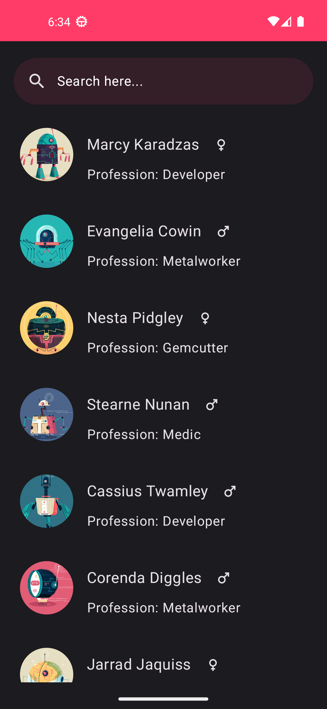
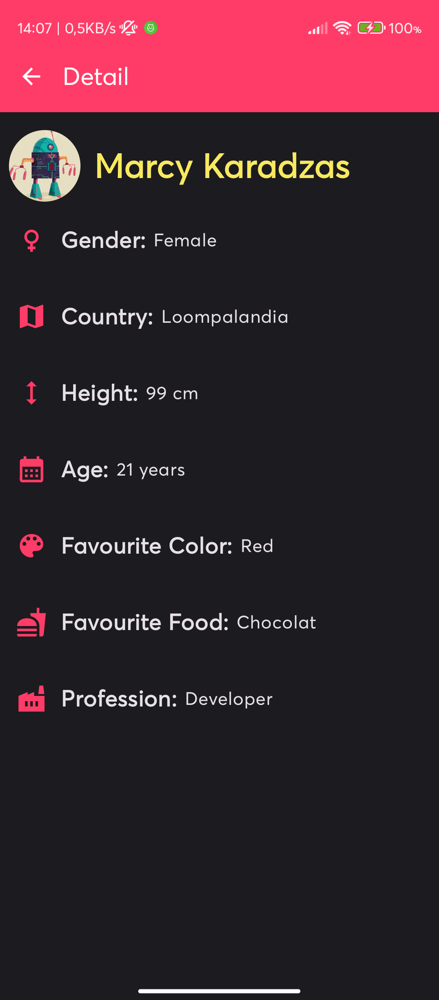
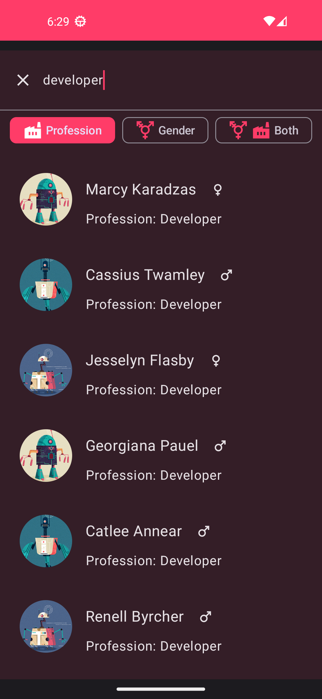

<!-- PROJECT LOGO -->
 

  

  <h3 align="center">Oompa Loompa App</h3>

  

    An app that show an Oompa Loompa list and the detail of each OompaLoompa
     
    This app provides a filter for search any Oompa Loompa by first name or last name, profession, gender
  

<!-- TABLE OF CONTENTS -->

  
Table of Contents

    <ul>
        <li><a href="#built-with">Built With</a></li>
    </ul>

  
  
  

### Plugins and libraries
* Koin(for DI)
* Coil(for optimization and caching image requests)
* Retrofit(Highly need for API Requests)
* OkHttp Interceptor(Only for debug the api response)
* Converter GSON(for serialize the JSON response into object)
* Lottie(for the animations, user friendly, better UX for the user)
* Material Icons Extended(is the same of Material Icons but with more icons)
* The rest of libraries are the Android core, Material Components and coroutines libraries

### Built With
* ![Android][Android]
* 
* ![Kotlin][Kotlin]
* ![Gradle][Gradle]
  

<a href="#readme-top">back to top</a>

<!-- MARKDOWN LINKS & IMAGES -->
<!-- https://www.markdownguide.org/basic-syntax/#reference-style-links -->
[Android]: https://img.shields.io/badge/Android-0769AD?style=for-the-badge&logo=android&logoColor=white
[Kotlin]: https://img.shields.io/badge/kotlin-%237F52FF.svg?style=for-the-badge&logo=kotlin&logoColor=white
[Gradle]: https://img.shields.io/badge/Gradle-02303A.svg?style=for-the-badge&logo=Gradle&logoColor=white
